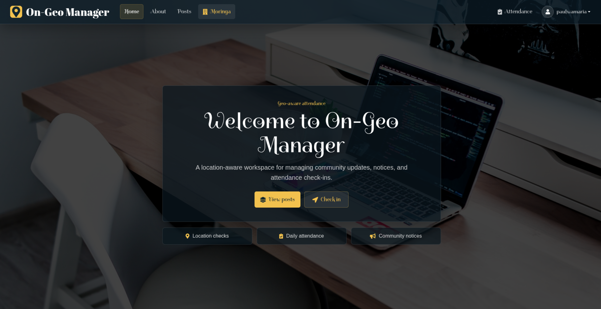

# On-Geo Manager

## Description

On-Geo Manager is a Django web application that connects people in an organisation and restricts access to selected information or resources based on their geographical location.



## Developer

Paul Kamau Wamaria

>> A simple Moringa Coursework Project


## User Stories

### BDD

* Users can sign up and manage their profiles.
* The application can compare a user's location with a configured checkpoint.
* If the user is within range, the application records attendance.
* If the user is out of range, the application returns an out-of-range status.
* Admins can manage organisation content and attendance visibility.


## Technology

* Python 3.12 as the primary language
* Django 4.2
* GeoDjango with PostGIS
* PostgreSQL
* HTML for content
* CSS and Bootstrap for styling
* JavaScript


## Local Setup

The project targets Python 3.12 and Django 4.2. It uses GeoDjango, so PostgreSQL must have PostGIS enabled.

### 1. Install System Dependencies

Fedora:

```bash
sudo dnf install -y gdal gdal-devel geos geos-devel proj proj-devel postgresql-server postgresql postgresql-contrib postgis
```

Initialize and start PostgreSQL if this is a fresh local install:

```bash
sudo postgresql-setup --initdb
sudo systemctl enable --now postgresql
pg_isready
```

Expected output:

```text
/var/run/postgresql:5432 - accepting connections
```

### 2. Create the Database

Open `psql` as the `postgres` user:

```bash
sudo -iu postgres psql
```

Create the app user, database, and PostGIS extensions:

```sql
CREATE USER ongeo_user WITH PASSWORD 'choose-a-strong-password';
CREATE DATABASE ongeo OWNER ongeo_user;
\c ongeo
CREATE EXTENSION IF NOT EXISTS postgis;
CREATE EXTENSION IF NOT EXISTS postgis_topology;
SELECT PostGIS_Version();
\q
```

### 3. Configure Environment Variables

Create a `.env` file in the project root:

```env
MODE=dev
SECRET_KEY=replace-this-with-a-dev-secret
DEBUG=True
ALLOWED_HOSTS=localhost,127.0.0.1

DB_NAME=ongeo
DB_USER=ongeo_user
DB_PASSWORD=choose-a-strong-password
DB_HOST=localhost
DB_PORT=5432
```

### 4. Create a Virtual Environment

```bash
python3.12 -m venv .venv312
source .venv312/bin/activate
python -m pip install --upgrade pip
python -m pip install -r requirements.txt
```

### 5. Run Migrations and Checks

```bash
python manage.py migrate
python manage.py check
python manage.py test ongeo --keepdb
```

### 6. Run the Server

```bash
python manage.py runserver
```

Visit `http://127.0.0.1:8000/`.

## Verification

Useful checks after dependency or environment changes:

```bash
.venv312/bin/python -m pip check
.venv312/bin/python manage.py makemigrations --check --dry-run
.venv312/bin/python manage.py check
.venv312/bin/python manage.py test ongeo --keepdb
```


## Contacts

* Primary Email: paulwamaria@gmail.com
* Secondary Email: helloemryon@gmail.com
* Phone: 0780404626

## Copyright
MIT License

[Copyright (c) 2019 Paulwamaria](LICENSE)
